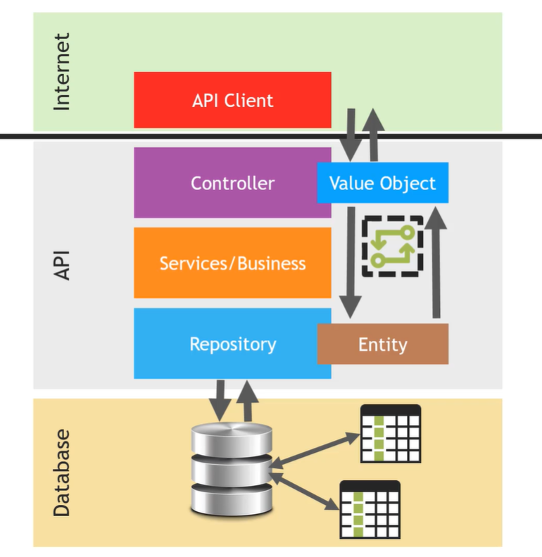

# rest-with-springboot-java

# How to run this project
1. On Intellij go to file Startup and run the app
2. path to swagger: http://localhost:8080/swagger-ui/index.html

# Spring security table schema

