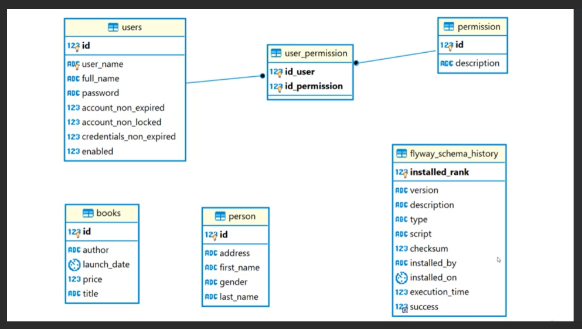
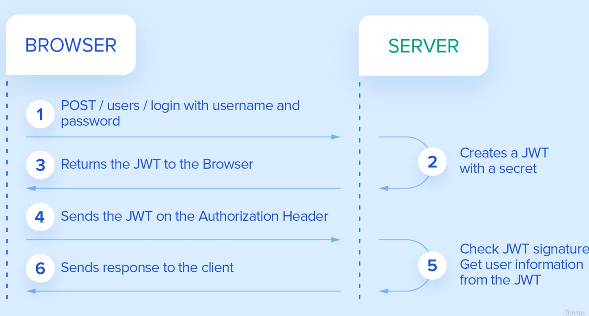

# rest-with-springboot-java

# How to run this project
1. On Intellij go to file Startup and run the app
2. path to swagger: http://localhost:8080/swagger-ui/index.html

# VO - Value Object Pattern

# Spring security table schema

# JWT authentication flow

#Running using docker compose
 >docker compose up -d --build  (this command must be executed in the dir of docker-compose.yml)

#List stacks in execution
 >docker compose ls
    
#List containers running
 >docker ps
 
#Show log from a specific container
 >docker logs container_id